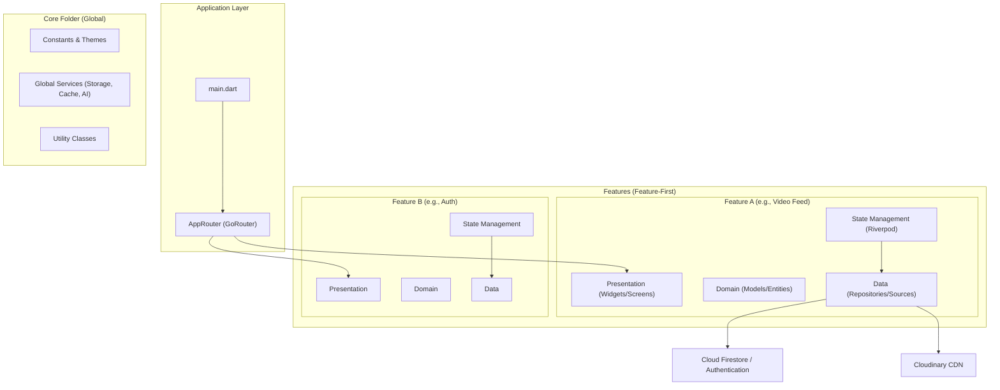

# RAY 📱

An AI-powered, immersive short-video entertainment platform built with **Flutter** and **Firebase**. RAY (Reelify) combines the high-velocity experience of TikTok with innovative AI Voice Assistant capabilities to create a modern, accessible, and high-performance social media ecosystem.


## 🌟 Key Features

*   **🎬 Immersive Video Feed**: A seamless, high-performance vertical scrolling feed with auto-playing video content and smart caching.
*   **🎙️ AI Voice Assistant**: Hands-free navigation and interaction using natural language voice commands ("Next", "Like this", "Go to profile").
*   **🔐 Secure Authentication**: Robust user onboarding and management via Firebase Authentication.
*   **🔍 Explore & Discover**: Algorithmic content discovery with hashtag searching and trending content grids.
*   **⚡ Real-time Social Logic**: Instant double-tap likes, global comment threads, follow/following tracking, and live statistical synchronization.
*   **📸 Content Creation Studio**: Native camera integration with real-time filters, video trimming, and optimized CDN uploads.
*   **📱 QR Profile Sharing**: Instant profile discovery via generated QR codes and an integrated mobile scanner.

## 🏛️ System Architecture

RAY implements a **Feature-First Clean Architecture** pattern to ensure modularity, scalability, and ease of testing.



For a deep dive into the architectural implementation, see [docs/Task3_SystemArchitecture.md](docs/Task3_SystemArchitecture.md).

## 🛠️ Tech Stack

*   **UI/UX**: [Flutter](https://flutter.dev/) (Material 3, [Flutter Animate](https://pub.dev/packages/flutter_animate))
*   **Backend**: [Cloud Firestore](https://firebase.google.com/docs/firestore), [Firebase Authentication](https://firebase.google.com/docs/auth)
*   **Storage & CDN**: [Cloudinary](https://cloudinary.com/) (Optimized Video Streaming), [Firebase Storage](https://firebase.google.com/docs/storage)
*   **State Management**: [Riverpod](https://riverpod.dev/) (Code Generation Approach)
*   **Navigation**: [GoRouter](https://pub.dev/packages/go_router)
*   **Video Processing**: [video_player](https://pub.dev/packages/video_player), [video_trimmer](https://pub.dev/packages/video_trimmer)
*   **AI/ML**: [Speech To Text](https://pub.dev/packages/speech_to_text), [Flutter TTS](https://pub.dev/packages/flutter_tts)

---

## 🚀 Getting Started

### 1. Prerequisites
*   Flutter SDK `>=3.0.0 <4.0.0`
*   A Firebase Project with `google-services.json` and `GoogleService-Info.plist`

### 2. Installation
```bash
# Clone the repository
git clone https://github.com/Duggineniakhil/RAY.git
cd RAY

# Install dependencies
flutter pub get

# Generate code (Riverpod/Labels)
dart run build_runner build --delete-conflicting-outputs
```

### 3. Dummy Data Seeding
To quickly populate your environment for testing:
Call `DummyDataService.seedAll(FirebaseFirestore.instance)` in your `main()` method to automatically generate users, videos, and comments.

---

## 📜 Detailed Documentation

The project development is documented across 10 strategic tasks:

1.  **[Problem Definition](docs/Task1_ProblemDefinition.md)**: Goals and requirements analysis.
2.  **[UI/UX Planning](docs/Task2_UI_UX_Planning.md)**: Wireframes and navigation flow.
3.  **[System Architecture](docs/Task3_SystemArchitecture.md)**: Clean Architecture & State Management.
4.  **[Database Design](docs/Task4_DatabaseSchema.md)**: Schema and ER Diagrams.
5.  **[AI Strategy](docs/Task5_AI_Integration.md)**: Voice navigation planning.
6.  **[Core Modules](docs/Task6_CoreModule.md)**: Feed and Auth implementation.
7.  **[CRUD Operations](docs/Task7_CRUD_Operations.md)**: Firestore interaction logic.
8.  **[AI Implementation](docs/Task8_AI_Features.md)**: Voice and Assistant features.
9.  **[UI Polishing](docs/Task9_UI_Polishing.md)**: Animations and final touches.
10. **[Final Delivery](docs/Task10_Final_Documentation.md)**: Handover and APK build.

## 📄 License
This project is licensed under the MIT License - see the LICENSE file for details.
