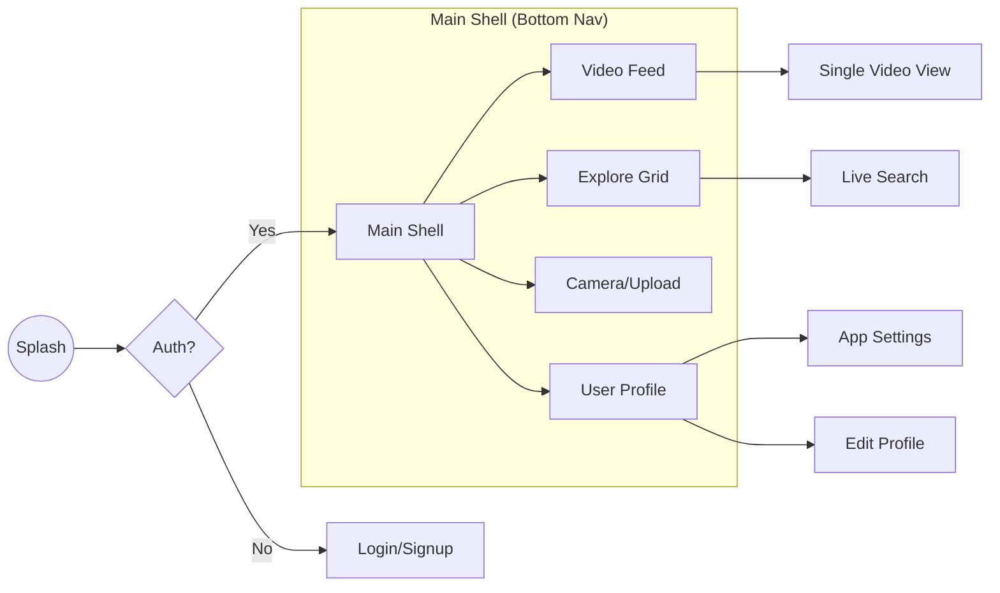

# Task 2: UI/UX Planning & Navigation Flow

## 🎨 Design Vision
RAY leverages an **Immersive Dark Aesthetic**. By utilizing full-bleed video backgrounds and high-contrast overlays, the UI disappears to let the content lead.

---

## 🧭 1. Navigation Architecture
We utilize a flattened navigation hierarchy to minimize tapping distance to core features.

---

## 📱 2. Core Screen Specifications

### 🎬 Immersive Video Feed
- **Interaction Layer**: Transparent overlay featuring `Lottie` heart animations and a horizontally scrolling music marquee.
- **Gestures**: 
  - `DragVertical`: Page pagination.
  - `Tap`: Toggle Play/Pause.
  - `DoubleTap`: Instant Like interaction.

### 📸 Content Studio
- **Preview**: Real-time GPU-accelerated filter preview via `camera` package.
- **Native Trimming**: Frame-accurate video extraction using native platform channels to avoid heavy FFmpeg overhead.

### 👤 Profile Analytics
- **Grid views**: Staggered dual-tabbed layout switching between 'Own Videos' and 'Saved/Liked' content.
- **Micro-Animations**: Staggered entry animations for grid tiles using `flutter_animate`.

---

## 🛠️ 3. Navigation Implementation
- **Router**: Managed by `GoRouter` for declarative routing.
- **Transitions**: Seamless `SlideTransition` logic used for all secondary screen pushes to maintain a consistent "swiping" feel throughout the UX.
