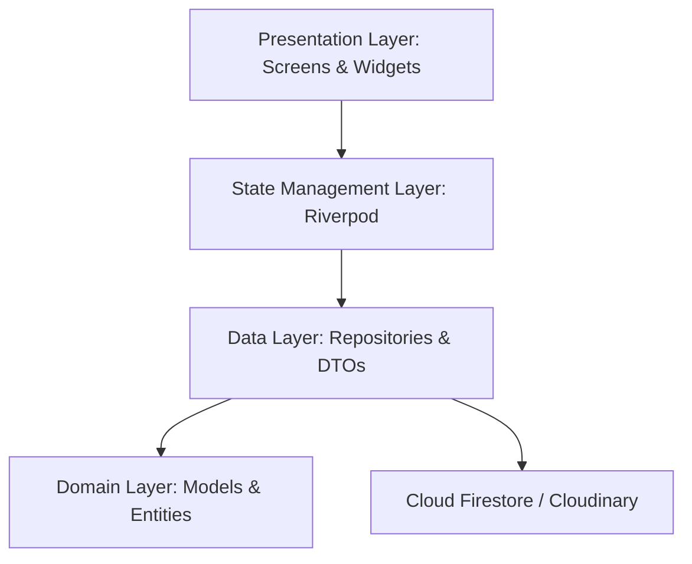

# Task 3: System Architecture & State Management

## 🏛️ 1. Professional Architecture Pattern
RAY strictly adheres to the **Feature-First Clean Architecture**. This approach ensures that features are independent, testable, and maintainable.

### 🧩 Layer Responsibilities

---

## 📁 2. Structural Breakdown

- **`lib/features/`**: The heart of the app. Each folder (e.g., `video_feed`) contains its own `data`, `domain`, and `presentation` directories.
- **`lib/core/`**: Shared infrastructure.
  - `constants/`: Global strings, theme tokens, and collection names.
  - `services/`: Singleton handles for system-level logic like `ThumbnailCacheService`.
  - `utils/`: Reusable helpers like `AppRouter` and `CameraFilters`.

---

## ⚡ 3. State Management Logic
We utilize the **Riverpod** ecosystem for a declarative, reactive UI.

| Module | Type | Purpose |
| :--- | :--- | :--- |
| **Auth** | `StreamProvider` | Reactively updates UI on Firebase Auth state changes. |
| **Feed** | `AsyncNotifier` | Manages pagination, loading states, and algorithmic sorting of videos. |
| **Profile** | `StateProvider` | Tracks UI-local state like selected tabs and follow status. |

### Key Performance Benefits
- **Scoped Rebuilds**: Only the specific widget watching a provider rebuilds during state updates.
- **Automatic Caching**: Riverpod handles object lifetimes, ensuring repositories aren't unnecessarily recreated.
- **Compile-time Safety**: Leveraging `riverpod_generator` to eliminate common provider lookup errors.
