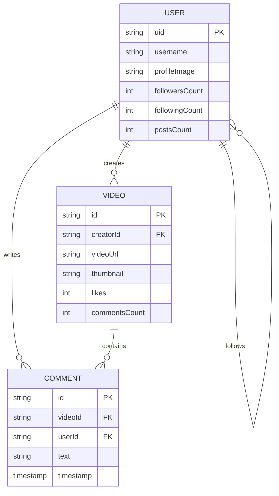

# Task 4: Database Schema & ER Diagram

## 🗄️ 1. Database Infrastructure
- **Core Storage**: Google Cloud Firestore (NoSQL).
- **Media Optimization**: Cloudinary (CDN) for adaptive video delivery.

---

## 📊 2. Entity Relationship Model

---

## 📝 3. Collection Specifications

### `users` Collection
Optimized for profile discovery and social tracking.
- **Denormalization**: `followersCount` and `likesCount` are updated via transactions to avoid expensive count queries.

### `videos` Collection
The high-velocity data source for the main feed.
- **Metadata**: Stores `uploadTime` for sorting and `filterIndex` to persist creator choices.
- **Architecture**: Mapped to `VideoModel` via `fromFirestore` factories with safe-null handling.

### `comments` Collection
- **Mapping**: Each document carries a `videoId` field for direct indexing, allowing global comment retrieval without deep-nested subcollection overhead.

---

## 🛡️ 4. Data Protection & Integrity
- **Security Rules**: Firestore rules ensure only authenticated owners can `update` their own metadata or `delete` their uploaded content.
- **Performance**: Indexes configured for `uploadTime` and `creatorId` to support high-speed pagination in the Discover and Profile grids.
