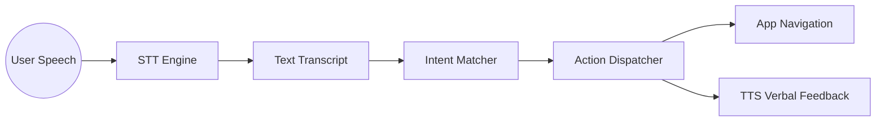

# Task 5: AI Integration Strategy

## 🧠 1. The Vision: Hands-Free Interaction
RAY differentiates itself through an **AI-First Navigation Layer**. By utilizing advanced Speech-To-Text (STT) and Natural Language Understanding (NLU) patterns, we enable a truly hands-free video consumption experience.

---

## ⚙️ 2. The AI Pipeline

---

## 🛠️ 3. Core Technologies
1.  **Speech Transcription**: Powered by the native OS engines (Android/iOS) via `speech_to_text`.
2.  **Logic Engine**: A dedicated `VoiceAssistantService` that performs "fuzzy matching" on transcripts.
3.  **Auditory Feedback**: `flutter_tts` provides verbal confirmation (e.g. "Opening profile") to close the UX loop for non-visual users.

---

## 🗣️ 4. Supported Command Sets

| Command Intent | Targeted App Action |
| :--- | :--- |
| **"Next Video"** | Advances the Feed PageController by one. |
| **"Heart this"** | Triggers the like transaction on the current video. |
| **"Search [Query]"** | Navigates to Explore and executes the search for [Query]. |
| **"Go to Profile"** | Executes a context push to the user's dashboard. |

---

## 🛡️ 5. Privacy & Ethics
- **On-Demand Only**: The microphone is only active when the visual AI trigger is engaged.
- **Local Processing**: Transcriptions are processed on-device wherever possible to minimize latency and maximize user privacy.
